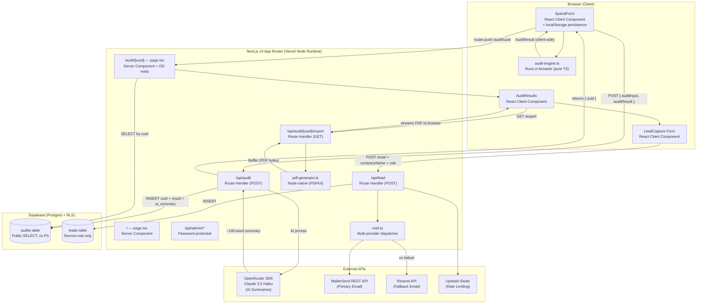

# Architecture — SpendLens

## System Diagram

---

## Data Flow: Input → Audit Result

1. **User fills SpendForm** (`SpendForm/index.tsx`, client component)
   Selects tools, plans, monthly spend, and seat count across 3 progressive steps. All state persisted to `localStorage` on every change — no data lost on refresh.

2. **"Run Audit" clicked** → `runAudit(input)` executes **entirely in the browser** (zero network call).
   The pure TypeScript engine returns `AuditResult` with per-tool `ToolRecommendation[]`, `redundancyWarnings[]`, `totalMonthlySavings`, `totalAnnualSavings`, `isHighSavings`, and `confidenceScore`.

3. **POST `/api/audit`** — sends `{ auditInput, auditResult }` to the Route Handler.
   - **Rate limit:** Upstash Redis checks IP. Blocks at >10 req/min.
   - **AI Synthesis:** Calls OpenRouter (Claude 3.5 Haiku) with a structured prompt containing the `AuditResult`. Falls back to a template string if the API times out.
   - **Persistence:** Inserts `uuid`, `audit_result`, `ai_summary`, `total_monthly_savings`, `total_annual_savings`, `is_high_savings` into `audits` table using service-role key.
   - **Returns:** `{ uuid: string }`.

4. **Redirect to `/audit/[uuid]`** — Next.js Server Component fetches the row using the anon key (public read, RLS allows SELECT on `audits`, no PII exposed). Generates dynamic Open Graph meta tags with the savings amount for social sharing. Renders `AuditResults` + `LeadCapture`.

5. **Lead submits email** → POST `/api/lead` → rate-limited → inserts into `leads` table (service-role, private RLS). Fires `mail.ts` dispatcher which tries MailerSend first, falls back to Resend, attaches the generated PDF as Base64.

6. **PDF export** → GET `/api/audit/[uuid]/export` → fetches audit from Supabase → runs `pdf-generator.ts` (PDFKit, Node-native) → streams the A4 PDF directly to the browser.

---

## Why This Stack

| Concern | Choice | Reason |
|---------|--------|--------|
| **Framework** | Next.js 14 App Router | Server Components for SEO on result pages; OG image generation at the edge; zero extra infra to manage |
| **Language** | TypeScript (strict mode) | Audit engine is financial — silent type bugs would produce wrong dollar figures |
| **Styling** | Tailwind CSS v4 + shadcn/ui | Zero runtime CSS; components are copy-owned (not a dependency); v4's CSS-first config eliminates `tailwind.config.js` boilerplate |
| **Database** | Supabase (Postgres + RLS) | Built-in Row-Level Security isolates lead PII from public audit data without extra middleware |
| **Auth** | None (by design) | Value-first funnel: email captured *after* the audit is shown, never before. Maximises conversion. |
| **AI** | OpenRouter → Claude 3.5 Haiku | Model-agnostic: swap to Sonnet or GPT-4o via one env var. Used only for narrative prose, never for the math. |
| **Email (primary)** | MailerSend REST API | Trial domain delivers without custom domain verification; robust Base64 attachment support |
| **Email (fallback)** | Resend | Fallback if MailerSend quota exceeded; same API shape |
| **PDF** | PDFKit (Node-native) | Python/ReportLab requires `child_process.exec` which fails silently in Vercel's serverless environment |
| **Rate limiting** | Upstash Redis | Edge-compatible, serverless-safe, no cold-start penalty |

---

## Scaling to 10k Audits/Day

1. **Rate limiting** is already wired — activate Upstash middleware on `/api/audit`. Free tier handles ~500k req/day.

2. **Supabase connection pooling** — switch to PgBouncer (Transaction mode) to prevent exhausting Postgres connections from concurrent serverless invocations.

3. **Result caching** — add `Cache-Control: s-maxage=3600` on `/audit/[uuid]` pages. Results are immutable after creation; Vercel CDN would serve >90% of reads without touching Supabase.

4. **Audit engine stays client-side** — the pure TS engine runs in the browser. 10k audits/day = zero server compute for core logic.

5. **Email queue** — move MailerSend calls off the request path into a background job (Vercel Cron or Upstash QStash) to prevent P99 latency spikes on `/api/lead`.

---

## Security Notes

- **Admin bypass:** The `/contact` page doubles as an admin portal. Submitting with `name=ADMIN` and `email=root@credex.rocks` triggers a redirect to `/login` where Supabase Magic Link authentication grants access to `/admin`.
- **Honeypot:** The lead capture form includes a hidden `website` field. Any submission with this field populated is silently discarded (bot detection without CAPTCHA friction).
- **RLS policy:** `leads` table has `FOR ALL USING (false)` on the public role — no anon reads possible. `audits` table allows `SELECT` on public role but strips email/company fields via a view.
- **No secrets in client:** All API keys (`SUPABASE_SERVICE_ROLE_KEY`, `OPENROUTER_API_KEY`, `MAILERSEND_API_KEY`) are server-only environment variables, never exposed to the browser bundle.
